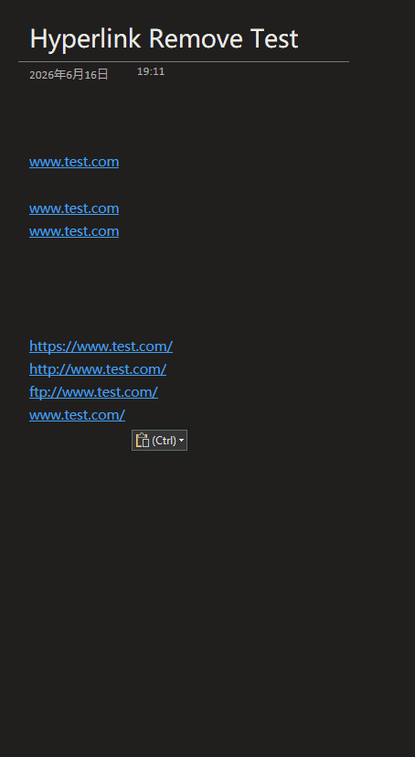

# OneNoteHyperlinkRemover

> **[English](#english)** | **[中文](#中文)**

---

## English

OneNote COM Add-in: Remove auto-converted URL hyperlinks.

> **⬇️ [Download latest MSI installer](https://github.com/OneNoteHyperlinkRemover/OneNoteHyperlinkRemover/releases/latest)** — one-click install, no build required



### Features

OneNote automatically converts typed or pasted URLs into clickable hyperlinks with no built-in option to disable it. This add-in provides:

- **Manual removal** — scan the current page and restore auto-converted hyperlinks to plain text
- **Selection removal** — remove hyperlinks from selected text only
- **Auto-monitoring** — automatically detect and remove new auto-converted hyperlinks when enabled
- **Clipboard cleanup** — optional monitor that strips zero-width spaces from clipboard, only active within OneNote (default off)
- **Copy clean text** — right-click menu to copy selected text with zero-width spaces removed
- **Smart detection** — only removes OneNote auto-converted hyperlinks (where href equals display text), preserving manually created meaningful hyperlinks

### How the Zero-width Space Trick Works

OneNote has no API to disable auto-hyperlink conversion. Even after stripping a `<a>` tag, OneNote will immediately re-convert the plain URL text back into a hyperlink. To break this cycle, the add-in inserts a [zero-width space](https://en.wikipedia.org/wiki/Zero-width_space) (U+200B) at key URL patterns (`://` and `www.`) when restoring plain text. The zero-width space is invisible to users but breaks OneNote's URL pattern matching, preventing re-conversion.

When you copy text containing these zero-width spaces, the **Clipboard Monitor** (optional, default off) automatically strips them from the clipboard so the URL remains clean when pasted elsewhere. This monitoring only activates when text is copied within OneNote.

### Requirements

- Visual Studio 2022 (with "Office/SharePoint development" workload)
- .NET Framework 4.8
- Microsoft OneNote (Microsoft 365)
- Windows 10/11

### Tested Environment

- Microsoft® OneNote® for Microsoft 365 MSO (Version 2605 Build 16.0.20026.20168) 64-bit
- Downloaded from [Microsoft Store](https://apps.microsoft.com/detail/xpffzhvgqwwlhb)

### Build

```powershell
# Open OneNoteHyperlinkRemover.sln in Visual Studio, or use command line:
msbuild OneNoteHyperlinkRemover.sln /p:Configuration=Release
```

Output: `bin\Release\`

### Install

**Option 1: MSI installer (recommended)**

Download the latest `OneNoteHyperlinkRemover.msi` from [Releases](https://github.com/OneNoteHyperlinkRemover/OneNoteHyperlinkRemover/releases/latest). Requires .NET Framework 4.8. The installer copies the DLL to Program Files, registers the COM component, and adds the OneNote add-in registry entry automatically. Restart OneNote after installation.

**Option 2: Manual register**

```powershell
# Build first, then run PowerShell as Administrator
.\Scripts\Register.ps1 -Configuration Release
```

### Usage

1. Restart OneNote
2. Find the add-in group on the **Home** tab
3. Click **Remove Page Links** to scan and remove auto-converted hyperlinks on the current page
4. Click **Remove Selection Links** to process selected text only
5. Toggle **Auto-remove** to enable/disable automatic monitoring
6. Toggle **Auto-clean Clipboard ZWS** to enable/disable zero-width space cleanup (only active within OneNote)
7. Right-click selected text → **Copy Text Without ZWS** to copy clean text to clipboard

### Uninstall

```powershell
# Run PowerShell as Administrator
.\Scripts\Unregister.ps1
```

Then restart OneNote.

### Technical Architecture

This is a **COM Add-in** (not VSTO) because OneNote does not support VSTO project templates.

#### Core Interfaces

- `IDTExtensibility2` — COM add-in lifecycle (OnConnection, OnDisconnection, etc.)
- `IRibbonExtensibility` — Ribbon UI definition and callbacks

#### Key Files

| File | Description |
|------|-------------|
| `AddIn.cs` | Entry point — COM interface and Ribbon callbacks |
| `OneNoteHelper.cs` | OneNote COM API wrapper, manages IApplication lifecycle |
| `HyperlinkRemover.cs` | Core logic: parse page XML, detect and remove auto-converted hyperlinks |
| `ClipboardMonitor.cs` | Background clipboard watcher for zero-width space cleanup |
| `Strings.cs` | Bilingual string dictionary (zh/en) |
| `Ribbon\Ribbon.xml` | Ribbon UI definition |
| `Scripts\Register.ps1` | Registration script |
| `Scripts\Unregister.ps1` | Unregistration script |

#### How It Works

1. Get current page XML via `IApplication.GetPageContent()`
2. Parse page structure using LINQ to XML (Outline → OE → T elements)
3. Find `<a href="...">text</a>` tags inside T element CDATA
4. Identify auto-converted hyperlinks (href equals display text, or display text is a URL)
5. Replace auto-converted hyperlinks with plain text (with zero-width spaces to prevent re-linking)
6. Write back modified page via `IApplication.UpdatePageContent()`

#### COM Object Lifecycle

Following OneMore's design: **do not hold IApplication COM reference long-term**. Each operation creates a new instance and releases it immediately, preventing interference with OneNote shutdown.

#### Bilingual Support

UI language is auto-detected from `CultureInfo.CurrentUICulture`. All Ribbon labels use `getLabel` callbacks that read from `Strings.cs`. To add a new language, extend the `Map` dictionary in `Strings.cs`.

### Background

The idea for this project had been on my mind for a long time, but I never got around to implementing it — until Coding Agents matured enough to make it possible with AI assistance.

The following links are the issues and discussions that inspired this project:

- [SuperUser: OneNote 2010 — Remove hyperlink](https://superuser.com/questions/505778/onenote-2010-remove-hyperlink)
- [Reddit: Type a UNC path without creating a link](https://www.reddit.com/r/OneNote/comments/qla8jf/type_a_unc_path_without_creating_a_link/)
- [Microsoft Q&A: Removing links in OneNote](https://learn.microsoft.com/en-us/answers/questions/5273901/removing-links-in-onenote)
- [Microsoft Q&A: OneNote 2013 (zh-CN)](https://learn.microsoft.com/zh-cn/answers/questions/4874368/onenote-2013?forum=msoffice-all&referrer=answers)
- [Microsoft Q&A: How to paste plain text to OneNote](https://learn.microsoft.com/en-us/answers/questions/4805381/how-to-paste-plain-text-to-onenote?forum=msoffice-all&referrer=answers)
- [Reddit: Hyperlinks in OneNote](https://www.reddit.com/r/OneNote/comments/1adwdh7/hyperlinks_in_on/)
- [Microsoft Q&A: Why does the feature to remove link get disabled](https://learn.microsoft.com/en-us/answers/questions/1290065/why-does-the-feature-to-remove-link-get-disabled-f)

### References

- [OneMore](https://github.com/stevencohn/OneMore) — Feature-rich OneNote COM add-in (C#, .NET Framework 4.8)

---

## 中文

OneNote COM 加载项：移除 OneNote 自动将 URL 转换为超链接的行为。

> **⬇️ [下载最新 MSI 安装包](https://github.com/OneNoteHyperlinkRemover/OneNoteHyperlinkRemover/releases/latest)** — 一键安装，无需编译


### 功能说明

OneNote 会自动将粘贴或输入的 URL 文本转换为可点击的超链接，且没有内置选项可以禁用此行为。本插件提供：

- **手动移除** — 一键扫描当前页面，将自动转换的超链接恢复为纯文本
- **选区移除** — 仅移除选中文字中的超链接
- **自动监控** — 开启后自动检测并移除新出现的自动超链接
- **剪贴板清理** — 可选的剪贴板监控，自动清除零宽空格，仅在 OneNote 内生效（默认关闭）
- **复制移除零宽空格后的文本** — 右键菜单，复制选中文字到剪贴板并清除零宽空格
- **智能识别** — 只移除 OneNote 自动转换的超链接（href 和显示文本相同），保留用户手动创建的有意义的超链接

### 零宽字符原理

OneNote 没有提供禁用自动超链接转换的 API。即使通过 COM 接口移除了 `<a>` 标签，OneNote 仍会立即将纯文本 URL 重新转换为超链接。为了打破这个循环，插件在恢复纯文本时向 URL 的关键位置（`://` 和 `www.`）插入一个[零宽空格](https://en.wikipedia.org/wiki/Zero-width_space)（U+200B）。零宽空格对用户不可见，但能破坏 OneNote 的 URL 模式匹配，阻止重新转换。

当用户复制包含零宽空格的文本时，**剪贴板监控**（可选，默认关闭）会自动清除剪贴板中的零宽空格，确保粘贴到其他地方的 URL 保持干净。此监控仅在 OneNote 内复制文本时生效。

### 开发环境要求

- Visual Studio 2022（需要"Office/SharePoint 开发"工作负载）
- .NET Framework 4.8
- Microsoft OneNote（Microsoft 365 版本）
- Windows 10/11

### 测试环境

- Microsoft® OneNote® 适用于 Microsoft 365 MSO (版本 2605 Build 16.0.20026.20168) 64 位
- 下载地址：[Microsoft Store](https://apps.microsoft.com/detail/xpffzhvgqwwlhb)

### 编译

```powershell
# 使用 Visual Studio 打开 OneNoteHyperlinkRemover.sln 编译
# 或使用命令行：
msbuild OneNoteHyperlinkRemover.sln /p:Configuration=Release
```

编译输出在 `bin\Release\` 目录。

### 安装

**方式一：MSI 安装包（推荐）**

从 [Releases](https://github.com/OneNoteHyperlinkRemover/OneNoteHyperlinkRemover/releases/latest) 下载最新的 `OneNoteHyperlinkRemover.msi`。需要 .NET Framework 4.8。安装程序会自动将 DLL 复制到 Program Files、注册 COM 组件并添加 OneNote 加载项注册表项。安装后重启 OneNote 即可。

**方式二：手动注册**

```powershell
# 先编译，然后以管理员权限运行 PowerShell
.\Scripts\Register.ps1 -Configuration Release
```

### 使用方法

1. 重启 OneNote
2. 在"开始"选项卡中找到插件分组
3. 点击"移除本页超链接"扫描并移除当前页面的自动超链接
4. 点击"移除选区超链接"仅处理选中文字
5. 点击"自动移除本页超链接"切换按钮开启/关闭自动监控模式
6. 点击"自动清理剪贴板零宽空格"切换按钮开启/关闭剪贴板清理（仅在 OneNote 内生效）
7. 选中文字后右键 → "复制移除零宽空格后的文本"复制干净文本到剪贴板

### 卸载

```powershell
# 以管理员权限运行
.\Scripts\Unregister.ps1
```

然后重启 OneNote。

### 技术架构

这是一个 **COM Add-in**（不是 VSTO），因为 OneNote 不支持 VSTO 项目模板。

#### 核心接口

- `IDTExtensibility2` — COM 加载项生命周期（OnConnection、OnDisconnection 等）
- `IRibbonExtensibility` — Ribbon UI 定义和回调

#### 关键文件

| 文件 | 说明 |
|------|------|
| `AddIn.cs` | 入口点，实现 COM 接口和 Ribbon 回调 |
| `OneNoteHelper.cs` | OneNote COM API 封装，管理 IApplication 生命周期 |
| `HyperlinkRemover.cs` | 核心逻辑：解析页面 XML，识别并移除自动超链接 |
| `ClipboardMonitor.cs` | 后台剪贴板监控，清理零宽空格 |
| `Strings.cs` | 中英双语字符串字典 |
| `Ribbon\Ribbon.xml` | Ribbon UI 定义 |
| `Scripts\Register.ps1` | 注册脚本 |
| `Scripts\Unregister.ps1` | 注销脚本 |

#### 工作原理

1. 通过 `IApplication.GetPageContent()` 获取当前页面的 XML 内容
2. 使用 LINQ to XML 解析页面结构（Outline → OE → T 元素）
3. 在 T 元素的 CDATA 内容中查找 `<a href="...">text</a>` 标签
4. 识别自动转换的超链接（href 和显示文本相同或显示文本是 URL）
5. 将自动超链接替换为纯文本（插入零宽空格防止重新转换）
6. 通过 `IApplication.UpdatePageContent()` 写回修改后的页面

#### COM 对象生命周期

参考 OneMore 项目的设计：**不长期持有 IApplication COM 引用**，每次操作创建新实例并及时释放，避免阻止 OneNote 正常关闭。

#### 多语言支持

UI 语言根据 `CultureInfo.CurrentUICulture` 自动检测。所有 Ribbon 标签通过 `getLabel` 回调从 `Strings.cs` 读取。如需添加新语言，扩展 `Strings.cs` 中的 `Map` 字典即可。

### 项目背景

这个想法早就在脑海中了，只是一直没有时间去实现——直到今天 Coding Agent 发展成熟，才有机会借助 AI 将其实现。

以下链接提到的问题是我创建这个项目的初衷和灵感：

- [SuperUser: OneNote 2010 — 移除超链接](https://superuser.com/questions/505778/onenote-2010-remove-hyperlink)
- [Reddit: 输入 UNC 路径时不要自动创建链接](https://www.reddit.com/r/OneNote/comments/qla8jf/type_a_unc_path_without_creating_a_link/)
- [Microsoft Q&A: 移除 OneNote 中的链接](https://learn.microsoft.com/en-us/answers/questions/5273901/removing-links-in-onenote)
- [Microsoft Q&A: OneNote 2013](https://learn.microsoft.com/zh-cn/answers/questions/4874368/onenote-2013?forum=msoffice-all&referrer=answers)
- [Microsoft Q&A: 如何向 OneNote 粘贴纯文本](https://learn.microsoft.com/en-us/answers/questions/4805381/how-to-paste-plain-text-to-onenote?forum=msoffice-all&referrer=answers)
- [Reddit: OneNote 中的超链接](https://www.reddit.com/r/OneNote/comments/1adwdh7/hyperlinks_in_on/)
- [Microsoft Q&A: 为什么移除链接功能被禁用了](https://learn.microsoft.com/en-us/answers/questions/1290065/why-does-the-feature-to-remove-link-get-disabled-f)

### 参考项目

- [OneMore](https://github.com/stevencohn/OneMore) — 功能丰富的 OneNote COM 加载项（C#，.NET Framework 4.8）
